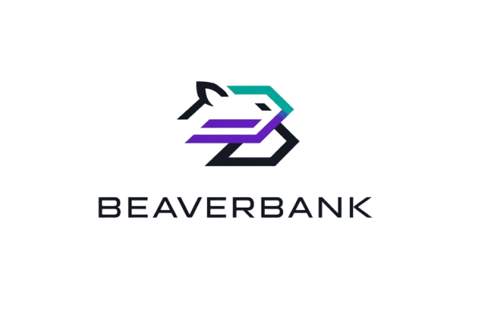

# 🦫 BeaverBank

<p align="center">
  
</p>

**BeaverBank** é uma implementação autoral de um **Neobank descentralizado** construído em Anchor para o **Desafio 1 (Opção B)** do Bootcamp Hackathon Global 2026. O projeto oferece uma solução **robusta e segura** para gerenciamento de contas bancárias on-chain, com suporte completo para transações de SOL e tokens SPL.

---

## 🔑 Identificadores do Programa

```
🌐 Devnet: 7Hrcju6Xgz6DPoyZSZLgeVjqbmxkcGSi2ZaXsL4KDN7C
```

---

## ⚡ Funcionalidades Principais

🏦 **Conta PDA Personalizada** — Cada usuário possui uma conta bancária descentralizada gerenciada por uma Programa Derived Address (PDA)  
💰 **Transações de SOL** — Depósito e saque de SOL com rastreamento seguro de saldo  
🪙 **Suporte a SPL Tokens** — Depósito e saque de tokens SPL via Cross-Program Invocations (CPI)  
🔐 **Vault Dedicado** — Cofre SPL centralizado em uma Associated Token Account com autoridade transferida para a PDA  
🛡️ **Encerramento Seguro** — Contas só podem ser fechadas quando todos os saldos estão zerados  
✅ **Cobertura de Testes** — Suite automatizada validando fluxos positivos e casos de segurança críticos  

---

## 🏗️ Arquitetura do Sistema

### 📊 Componente: Conta Bancária (`bank_account`)

A conta principal é uma PDA derivada de `['bank', owner_pubkey]`, mantendo o seguinte estado:

| Campo | Tipo | Propósito |
| --- | --- | --- |
| `owner` | `Pubkey` | Identificador do proprietário da conta |
| `bump` | `u8` | Bump seed para validação da PDA |
| `sol_balance` | `u64` | Saldo de SOL rastreado em lâmports |
| `token_mint` | `Pubkey` | Token SPL associado à conta (imutável após configuração) |
| `token_balance` | `u64` | Saldo de SPL rastreado em unidades brutes |
| `token_vault_initialized` | `bool` | Flag indicando se o cofre foi inicializado |

### 🏺 Componente: Cofre de Token (`token_vault`)

O cofre de SPL é uma Associated Token Account (ATA) criada sob autoridade da PDA, servindo como custódia segura dos tokens do usuário:

- **Autoridade:** `bank_account` (PDA)
- **Mint:** O token SPL configurado pelo usuário (fixo após a primeira configuração)
- **Finalidade:** Custodiar os tokens SPL da conta

---

## 🔒 Modelo de Segurança

### 🎯 Superfície de Ataque Identificada

1. Acesso não autorizado a contas de terceiros
2. Redirecionamento de tokens para mints diferentes
3. Saques acima do saldo disponível
4. Encerramento de contas com ativos residuais
5. Ataques de overflow em operações aritméticas

### 🛡️ Controles de Segurança Implementados

| Controle | Descrição | Localização |
| --- | --- | --- |
| **Autenticação por Signer** | Toda operação sensível requer assinatura do proprietário | Account constraints `#[account(signer)]` |
| **Autorização por Ownership** | Validação de ownership em cada instrução | Constraint `has_one = owner` |
| **Integridade de Endereço** | Validação de PDA com seeds + bump | Constraint `seeds` e `bump` |
| **Fixação de Mint** | Token SPL não pode ser alterado após configuração inicial | Campo imutável + constraint `TokenMintImmutable` |
| **Validação de Saldo** | Rejeição de saques acima do saldo disponível | `require!` antes de transferências |
| **Encerramento Seguro** | Conta fechable apenas com saldos zerados | Constraint `close = owner` com validação de saldo zero |
| **Proteção de Overflow** | Operações aritméticas com `checked_add/sub` | Uso de métodos safe em todos os cálculos |

### ✨ Invariantes de Segurança Mantidas

✔️ Somente o proprietário pode movimentar fundos de sua conta  
✔️ O saldo rastreado nunca pode ser negativo  
✔️ O vault SPL corresponde consistentemente ao mint configurado  
✔️ Uma conta só pode ser encerrada quando todos os ativos foram removidos

---

## 🔧 Instruções On-Chain

O programa oferece **sete instruções principais**:

1️⃣ **`initialize_bank_account`** — Cria uma nova conta bancária PDA para o usuário  
2️⃣ **`deposit_sol`** — Transfere SOL do usuário para a conta com atualização de saldo  
3️⃣ **`withdraw_sol`** — Retira SOL da conta para o proprietário (com validação de saldo)  
4️⃣ **`configure_token_vault`** — Inicializa o vault SPL e fixa o mint da conta  
5️⃣ **`deposit_spl`** — Transfere SPL para o vault via CPI `transfer_checked`  
6️⃣ **`withdraw_spl`** — Retira SPL do vault via CPI com autoridade da PDA  
7️⃣ **`close_bank_account`** — Encerra a conta e resgata o SOL de rent (exige saldos zerados)

---

## 🧪 Suite de Testes

A suite de testes em TypeScript (`anchor test`) valida:

✅ Fluxo completo de SOL (inicialização, depósito e saque)  
✅ Fluxo completo de SPL (configuração, depósito e saque)  
✅ Bloqueio de reconfigurações de mint (imutabilidade)  
✅ Bloqueio de acesso por não-proprietários (segurança)  
✅ Bloqueio de encerramento de contas com saldo residual  

**🎯 Resultado:** 5 testes passando com cobertura completa de casos críticos.

---

## 📚 Documentação Detalhada

Para informações aprofundadas sobre qualquer aspecto do projeto, consulte:

| 📄 Documento | 🎯 Focado Em | 📖 Conteúdo |
| --- | --- | --- |
| **[ARCHITECTURE.md](docs/ARCHITECTURE.md)** | Arquitetura e Design | Modelo de PDA em detalhe, layout de estado, fluxos de operações, interações de CPI, diagramas de autorização, escalabilidade |
| **[SECURITY.md](docs/SECURITY.md)** | Segurança e Validações | Análise de 7 ameaças with mitigations, invariantes de segurança, testes de validação, checklist para produção, boas práticas |
| **[API.md](docs/API.md)** | Referência Técnica | Cada instrução detalhada (parâmetros, contas, validações), exemplos de TypeScript, fluxos completos, referência de erros |
| **[USAGE.md](docs/USAGE.md)** | Operacional e Deployment | Setup inicial, build e testes, deploy em localnet e devnet, CLI de demonstração, troubleshooting, performance |
| **[DEVELOPMENT.md](docs/DEVELOPMENT.md)** | Contribução e Manutenção | Estrutura do projeto, workflow de desenvolvimento, boas práticas de código, testing, debugging, contribuição |
---

## 🚀 Execução Rápida

### 📦 Instalação e Build

```bash
npm install
npm run build
```

### 🧪 Rodar Testes

```bash
npm test
```

### 💻 Usar a CLI de Demonstração

```bash
npm run beaverbank -- help
```

---

## ✅ Checklist de Conformidade ao Desafio

- ✨ Programa funcional em Anchor com instruções principais
- ✨ Uso correto de Programa Derived Addresses (PDA) com seeds e bump
- ✨ Movimentação de SOL e SPL tokens
- ✨ Controle de acesso baseado em proprietário
- ✨ Testes automatizados com cobertura de segurança
- ✨ Documentação clara e bem estruturada

---

<div align="center">

### 🦫 **BeaverBank** — Segurança descentralizada ao seu alcance.

*Built with ❤️ for the Global Hackathon Bootcamp 2026*

</div>

